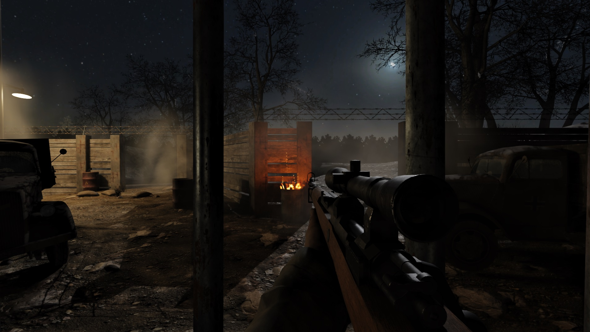
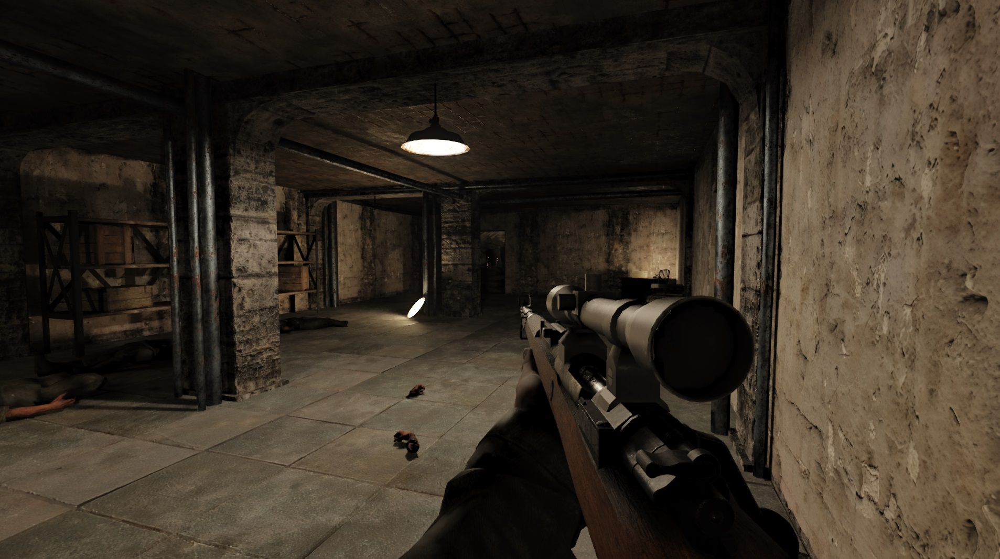
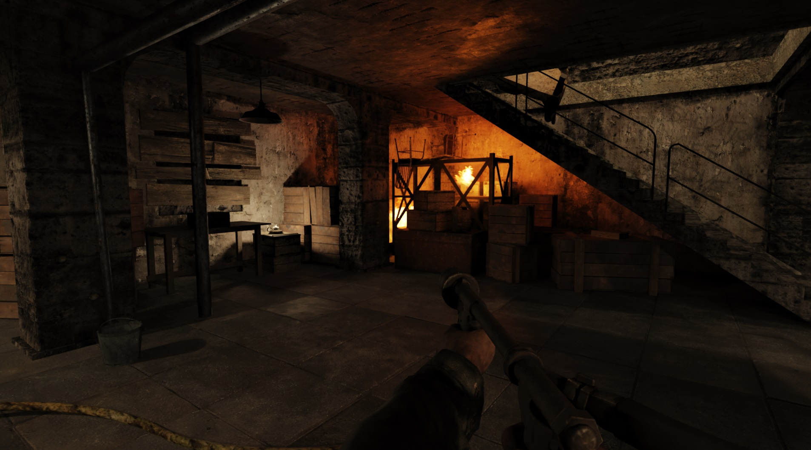

<h1 align="center">CoD-WaW (cod5) rtx-remix compatibility mod</h1>

 

This client modification is specifically made for nvidia's [rtx-remix](https://github.com/NVIDIAGameWorks/rtx-remix).  
How does a shader based game work with remix? By manually reimplementing fixed function rendering :) 

__SP__ is feature complete - __MP__ is working but not up-to-date.

 

### __[ Remix Compatibility Features ]__   
tweak sunlight, fog and skybox per map  
remix friendly culling and the ability to manually override culling per portal  
3D is fully rendered via the fixed-function pipeline  
spawning of unique anchor meshes to attach prims to  
per map loading of remix config's to set remix variables

 

If you want to buy me a coffee:  

# Usage

#### A. Easy way but might not feature the latest and greatest:
  - Download the latest [release](https://github.com/xoxor4d/t4-rtx/releases) and extract the contents into your CoDWaW root directory.  
  > The in-game console should show `t4-rtx {version} >` if the dll was loaded correctly.  
  If not, look at the [troubleshoot section](#t4-rtx-is-not-being-loaded) further down.  
 

#### B. Manual way but always up-to-date:

1) Download and install the latest full [release](https://github.com/xoxor4d/t4-rtx/releases) of t4-rtx as described above.  
  Required as it currently comes with a custom build of [`bridge-remix`](https://github.com/xoxor4d/bridge-remix/tree/feature/bridge-api-squashed) (api features)

 

2) Download the latest t4-rtx `github actions` build:  
  Release-binaries-t4-rtx - https://github.com/xoxor4d/t4-rtx/actions 
  - Drop `t4-rtx.asi` and the contents of the `assets` folder into your CoDWaW root directory and start the game.  
  The in-game console should show `t4-rtx {version} >` if the dll was loaded correctly.

 

#### ⚠️ Info: 
- Make sure to __DELETE__ `nvapi.dll` if you've used earlier builds of t4-rtx
- `t4-rtx.asi` has to be loaded via an asi loader
- For ease of use, releases and nightly builds ship with [Ultimate-ASI-Loader](https://github.com/ThirteenAG/Ultimate-ASI-Loader/releases) (`dsound.dll`)  

____

🔷 To clarify, this client mod is only making the game compatible with remix. 🔷   

🔷 It does _not_ enhance materials, meshes or lights 🔷  

### (__Outdated__)  
A demo mod can be found over at [ModDB](https://www.moddb.com/mods/cod5-nacht-der-untoten-demo) - [YouTube Footage](https://www.youtube.com/watch?v=hCv3p1qT3q0)  

____

 

# Tweakable Settings:

- A. Commandline Arguments:  
  - `-no_default_sky` :: disable spawning of a default sky on each map
  - `-stock_effects` :: render effects using shaders
  - `-old_anti_culling` :: use the old anti culling system (SP only)
  - `-no_fog` :: disable fog
  - `-no_forced_lod` :: do not set `r_forceLod` to `high` by default  
  - `-load_normal_spec` :: enable loading of specular and normal maps (if you need to for some reason)
  
  > eg: &ensp;`c:\path\CoDWaWmp.exe -no_default_sky -stock_effects` 

 

- B. Dvars: 

	🟩 encouraged to be tweaked  
	🟦 can be useful in edge case scenarios  
	🟧 shouldn't be touched 

  #### Culling dvars:
  🟩 `rtx_culling_plane_dist` :: distance of frustum culling planes  
	🟩 `rtx_fx_cull_elem_draw_radius` :: fx elements inside this radius around the player are not culled

  #### General dvars:
  🟩 `r_aspectRatio` :: **AUTO** is truly auto now and supports any aspect ratio
  🟩 `r_forceLod` :: force all models to a specific LOD  
	🟩 `r_lodScaleRigid` :: adjust static model draw distances (lower values increase draw distance)  
	🟩 `r_showTess` :: draws material info (incl. all image names) of surfaces (geometry / models)  
	🟩 `r_showTessDist` :: adjust draw distance of ^ info text  
  🟩 `r_showTessSkin` :: show info for skinned meshes
	🟩 `r_showCellIndex` :: show portal index info (useful for manual culling overrides via map settings)  
    
  #### Dvars that should only be changed if you know what you are doing:
  🟧 `rtx_sky_follow_player` :: sky will follow the player (helps with culling)  
  🟧 `r_warm_dpvs` :: disable all culling if true (not recommended - use `rtx_disable_world_culling`)
  🟧 `r_warm_static` :: unlimited draw distance for static models if true (not recommended, use `r_lodScaleRigid`)

  #### Culling dvars when `old_anti_culling` flag is set (or in `MP`):
	🟩 `rtx_disable_world_culling` :: tweak overall culling  
  🟩 `rtx_disable_entity_culling` :: tweak culling of script objects (entities)  

 

- C. Console commands:  
  - `export_entities` :: export map entities and static models (misc_models) to `t4rtx/entity-export/mapname.map`  
  - `mapsettings_update` :: reload map settings  
  - `mapsettings_get_defaults` :: prints sun direction, color and intensity in map_settings format based on the stock map settings
  - `unlockall` :: unlock all sp missions
  - `noborder` & `windowed` :: switch between borderless and normal windowed mode  
    - (set dvars `vid_xpos 0` and `vid_ypos 0` to put the window in the top left corner) 

 

- D. `map_settings.ini` :: `root/t4rtx` 

  🔸 Tweak sunlight / color, skybox and fog settings   
  🔸 Override culling per portal / cell (to fix light or shadow culling - dvar `r_showCellIndex`)   
  🔸 Spawn unique anchor meshes that can be used to attach unique prims and lights to  
  🔸 Ability to load multiple remix config's per map (`root/t4rtx/map_configs`)

 

- E. Assets Folder :: `root/t4rtx`

  - The `_assets` folder can be used to override certain game assets like gsc files without requiring a mod

 

## ⚠️ Current issues:
- Fullscreen, changing resolution or anything else that requires the game to restart the renderer might crash the game
- MP might be unstable until latest features are ported from SP

 

## 💭 Troubleshoot:
#### game wont load or shows an error on startup 
- Make sure you are on the latest version (1.7)
- Disable your onboard gpu (Device Manager or BIOS)
- Try to run the game in windowed mode: 
  - use commandline arguments like `c:\path\CoDWaW.exe +set r_fullscreen 0`
  - or edit your player config (`appdata/local/Activision/CoDWaW/players/yourprofile`)

#### Other issues
- ~~Captures loaded in the toolkit don't work correctly (UTF8 error), look [here](https://github.com/xoxor4d/t4-rtx/wiki/Home-%E2%80%90-General-Tips-%E2%80%90-Troubleshooting-%E2%80%90-etc)~~ (should be fixed)
- Using the remix toolkit currently requires you to have __no__ whitespaces in your game path
- Black main menu? Make sure the shadermodel dvar is set to 3.0 

 

## Compiling yourself:
1. Setup `COD5_ROOT` environment variable with path to your cod5 directory (optional)
2. Run `generate-buildfiles_vs22.bat` to generate build files (build folder)
3. Compile and copy `t4-rtx.asi` (renamed t4-rtx.dll) to your CoDWaW root folder  
   - ^ automatically happens if you setup `COD5_ROOT`

 

## Questions? 
- Join the [rtx-remix showcase](https://discord.gg/j6sh7JD3v9) discord and check out the cod5 thread within the `remix-projects` channel.
- Join the [iw3xo](https://discord.gg/t5jRGbj) discord if you have questions related to this modification
- rtx-remix: https://github.com/NVIDIAGameWorks/rtx-remix  

Not required but makes life easier:   
https://community.pcgamingwiki.com/files/file/714-call-of-duty-world-at-war-replacement-steam-multiplayer-executable/  

 

## Credits
- [People of the showcase discord](https://discord.gg/j6sh7JD3v9) (for testing, feedback and ideas)
- [ineedbots/JezuzLizard](https://github.com/JezuzLizard/T4SP-Server-Plugin) (for most of the structs)
- [nvidia - rtx-remix](https://github.com/NVIDIAGameWorks/rtx-remix)

 

	

	

